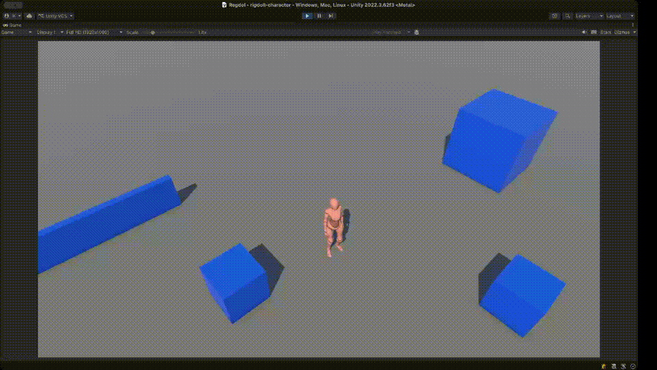

# Ragdoll Character Mechanic

A Unity project demonstrating advanced ragdoll physics with automatic recovery and stand-up animations.



## Overview

This project implements a modular ragdoll character system that seamlessly transitions between normal locomotion and physics-based ragdoll states. When the character collides with obstacles at sufficient force, it enters ragdoll mode, then automatically recovers and stands back up using context-aware animations.

## Features

- **Dynamic Ragdoll Activation**: Character enters ragdoll state based on collision impact force
- **Automatic Recovery**: Character automatically recovers after a configurable delay
- **Context-Aware Stand-Up**: Different stand-up animations depending on whether the character is facing up or down
- **Smooth Bone Transitions**: Interpolated bone positioning between ragdoll and animated states
- **Modular Architecture**: Clean separation of concerns with dedicated modules for input, movement, animation, collision, and ragdoll physics
- **Visual Feedback**: Optional impact effect spawning at collision points
- **Configurable Parameters**: Adjustable recovery time, impact thresholds, movement speed, and more

## Project Structure

```
Assets/_Project/
├── Animations/        # Character animations (idle, walking, running, falling, stand-up)
├── Materials/         # Materials and physics materials
├── Models/            # Character model (X Bot)
├── Prefabs/           # Player prefab and obstacle prefabs
├── Scenes/            # Main scene (Regdol.unity)
└── Scripts/           # Core gameplay scripts
    ├── RagdollCharacter.cs    # Main character controller
    ├── RagdollModule.cs       # Ragdoll physics management
    ├── MovementModule.cs      # Character movement
    ├── AnimationModule.cs     # Animation control
    ├── CollisionModule.cs     # Collision detection
    ├── InputModule.cs         # Input handling
    └── Helpers/               # Utility classes
```

## Technical Details

### Character States
- **Locomotion**: Normal movement and animation
- **Ragdoll**: Physics-based ragdoll state
- **ResettingBones**: Interpolating from ragdoll pose to stand-up pose
- **StandingUp**: Playing stand-up animation

### Key Components

**RagdollCharacter**: Main controller managing state transitions and coordinating all modules

**RagdollModule**: Handles ragdoll physics activation/deactivation and character orientation detection

**MovementModule**: Manages character movement with acceleration, rotation, and gravity

**AnimationModule**: Controls animator states and animation playback

**CollisionModule**: Detects collisions and filters ground vs obstacle hits

## Requirements

- Unity 2021.3 or later
- Universal Render Pipeline (URP)

## Getting Started

1. Open the project in Unity
2. Load the scene: `Assets/_Project/Scenes/Regdol.unity`
3. Press Play to test the ragdoll mechanics
4. Use WASD or arrow keys to move the character
5. Run into obstacles to trigger ragdoll physics

## Configuration

Key parameters can be adjusted in the Inspector on the Player prefab:
- **Recovery Delay**: Time before character starts recovering from ragdoll
- **Time To Reset Bones**: Duration of bone interpolation
- **Hit Mass Coef**: Multiplier for impact force calculation
- **Max Speed**: Character movement speed
- **Acceleration Coef**: How quickly character reaches max speed

## License

This project is available for educational and demonstration purposes.